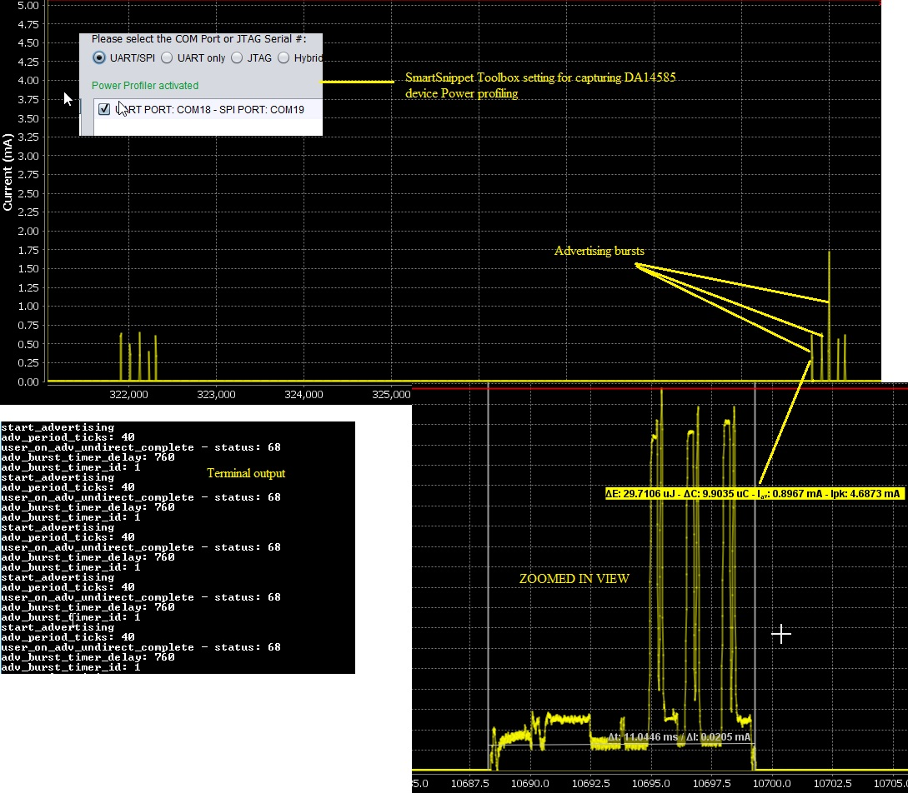

# ble_burst_adv

Burst Advertising with Bluetooth LE

## Example description

Simple example showing how to implement 'burst' advertising on the DA14585/6. Burst 
advertising is the process of sending a number of advertising events and then having 
a delay before sending another group of advertising events. This example allows the 
user to configure the number of advertising events to be transmitted per burst and 
the time between bursts. 
	
## HW and SW configuration

* **Hardware configuration**

	- This example runs on the DA14585/DA14586 Bluetooth Smart SoC devices.
	- A Basic or PRO Development kits is needed for this example.
	
* **Software configuration**

	- This example requires:
        * Smartsnippets Studio 2.0.8 (or later)
        * SDK6.0.10 (or later)

## How to run the example

For the initial setup of the project that involves linking the SDK to this SW example, please follow the Readme [here](__Github sdk6 readme link__).

### Initial Setup

1.  Build and download the example using the Keil IDE. 
2.  Run the example using the Keil debugger.
3.  Set jumpers on the basic or PRO development kits to use P0_4 and P0_5 for UART communication.
4.  Observe bursts of advertising events using of the following:
        * Monitor UART debug output using a terminal such as Teraterm etc.
		    - baudrate: 115200
		    - data: 8 bits
		    - stop: 1 bit
		    - parity: None
		    - flow control: none
        * Monitor current consumption using the Power Profiler found within the SmartSnippets Toolbox.
        * Monitor transmitted advertising events using a Smart Phone App such as LightBlue.
5. Undirected connecatable advertising is used for this demonstration.

The device should display the advertising data as shown in the picture below:

## Known Limitations

- There are No known limitations for this example. But you can check and refer to the following application note for
[known hardware limitations](https://www.dialog-semiconductor.com/sites/default/files/da1458x-knownlimitations_2019_01_07.pdf "known hardware limitations").
- Dialog Software [Forum Link](https://support.dialog-semiconductor.com/forums/dialog-smartbond-bluetooth-low-energy-%E2%80%93-software "Forum Link").
- You can also refer to the troubleshooting section in the [Getting Started Link](https://www.dialog-semiconductor.com/sites/default/files/um-b-049_da14585da14586_getting_started_guide_v2.1_0.pdf "DA1585x Getting Started with the Development Kit UM-B-049").

