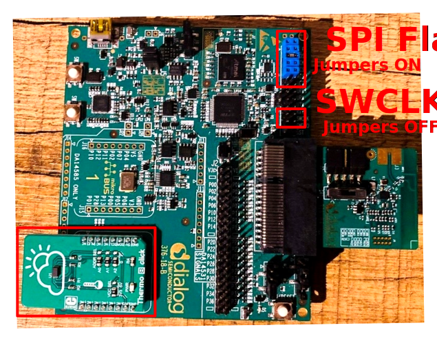
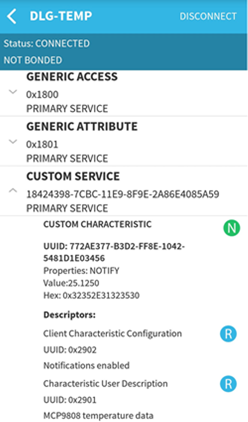

## Example description

This example shows:
- How to use I2C to read MCP9808 temperature register.
- How to use I2C to write MCP9808 resolution register.
- This example uses the [Thermo 8 click board](https://www.mikroe.com/thermo-8-click) from Mikroe which is based on the MCP9808.
- How to measure the temperature using DA14531 internal temperature sensor.

**Note 1** 
The internal temperature sensor is not available for the DA14585 and DA14586.

**Note 2** 
The functionality can be verified by BLE notifications.

## HW and SW configuration

This example runs on the BLE Smart SoC (System on Chip) devices:
- DA14585/DA14586 or DA14531 daughter board + DA145xxDEVKT-P PRO-Motherboard.
- DA14585/DA14586 daughter board + Basic development Kit mother board.

The user manuals for the development kits can be found:
- [Here](https://www.dialog-semiconductor.com/products/da14531-development-kit-pro) for the DA145xxDEVKT-P PRO-Motherboard.
- [Here](https://www.dialog-semiconductor.com/sites/default/files/um-b-048_da14585da14586_getting_started_guide_v2.0_0.pdf) for the Basic Development Kit.

__Hardware configuration DA14531 using DA145xxDEVKT-P PRO-Motherboard__
	
- Using thermo 8 click board.
	
Plug the thermo 8 click board on the mikrobus 2 interface (J17-J18). **Note that the JTAG/Debug interface will be no longer available** because the **P0_2** is shared between the **SWCLK** and the **I2C clock**.
This why we have opted to programme the onboard SPI flash with the generated binary and remove after that the JTAG debug Jumpers (J1:21-22 and J1:23-24). You can refer to the [section 16:SPI Flash Programmer](https://s3.eu-west-2.amazonaws.com/lpccs-docs.dialog-semiconductor.com/UM-B-083/tools/SPIFlashProgrammer.html) to see how to program the SPI flash with the Smarsnippets Toolbox.

Apply the jumper configuration of the image shown below.

	
if you would like to use the JTAG interface for debug purpose you have to choose different i2C GPIOs configurations. Be sure to update the `user_periph_setup.h` with the following configuration as an example:

	*#define MCP9808_SCL_PORT            GPIO_PORT_0
	*#define MCP9808_SCL_PIN	         GPIO_PIN_1
	*#define MCP9808_SDA_PORT            GPIO_PORT_0
	*#define MCP9808_SDA_PIN             GPIO_PIN_3
			
Then use jumpers wires to establish following connections between the DA145xxDEVKT-P PRO-Motherboard and the sensor click board:
 
	- Connect Vdd to V3 on J2.
	- Connect Gnd to ground on J2.
	- Connect SCL to P21 on J2.
	- Connect SDA to P23 on J2.

- Using internal sensor

Uncomment the CFG_USE_INTERNAL_TEMP_SENSOR definition (found in `da1458x_config_basic.h`) to acquire temperature via the internal temperature sensor. See line 205 in the image shown below.

__Hardware configuration DA14585/DA14586 using DA145xxDEVKT-P PRO-Motherboard__

Plug the thermo 8 click board on the mikrobus 1 interface (J15-J16).	

__Hardware configuration DA14585 using the basic development kit__

	- Connect Vdd to V3 on J4 (red line in the image below).
	- Connect Gnd to ground on J4 (blue line in the image below).
	- Connect SCL to P07 on J4 (orange line in the image below).
	- Connect SDA to P12 on J4 (yellow line in the image below).		

__Software configuration__

This example requires:

- [SDK6.0.14](https://www.dialog-semiconductor.com/da14531_sdk_latest).
- Keil5.
- __SEGGER’s J-Link__ tools should be downloaded and installed..

## How to run the example

### Setup
For the initial setup of the project that involves linking the SDK to this SW example, please follow the Readme [here](__Github sdk6 readme link__).

1. Start Keil using the `ble_temperature_ntf.uvprojx` Keil project file.

2. Expand the dialog shown in the red box in the image below.

3. Select your device: DA14531, DA14586 or DA14585.
		

4. Compile (F7) and launch (ctrl + F5) the example.\
If the warning (shown below) pops up press OK.
 

## Expected Results

1. Open the BLE scanner app and look for "DLG-TEMP".

2. Connect to the device.

3. Subscribe to the notifications.

If everything went well, you should be able to receive temperature data as the value of the custom characteristic, as shown in the image below.

__Note that the DA14531 internal temperature sensor uses int8_t instead of the double temperature value shown below__

## How it works

Tutorial 3 on the [Dialog Semiconductor support](https://www.dialog-semiconductor.com/sites/default/files/training_03_custom_profile_gatt_cmd_example_v1.2.pdf) website shows how to make your own custom profile. The **user_catch_rest_hndl** function in `user_peripheral.c` will handle the messages for our custom profile. This application only has one possible 
custom action: a write to the notification. When this occurs the **user_temperature_message_handler** function is called. This function will check the contents of the write. If the content of the write equals zero, the temperature timer is canceled. If the value is 
anything else, a timer is generated that calls **user_send_temperature_ntf** after NOTIFICATION_DELAY ms. **user_send_temperature_ntf** will read out the sensor data and convert it to a string(for demo purposes). The string will be placed in a message, along with some other parameters, like the connection ID
and the characteristic handle. After the message is sent, the app_easy_timer function is used to schedule the next call to the **user_send_temperature_ntf** function. This will ensure the temperature is transmitted regularly. The `app_easy_timer`function
has a resolution of 10ms hence we divide the desired delay in ms by 10.

## Troubleshooting
- Please check that the steps according to your daughter board (DA14531, DA14585 or DA14586) and mother board (basic development kit or DA145xxDEVKT-P PRO-Motherboard) are followed correctly.

- Try a different USB1 cable.

- Try different jumper wires, if used.

- Note that the internal temperature sensor only works for the DA14531

- If none of the above helps, please check the user manual according to your daughter board and mother board. User manual can be found [Here](https://www.dialog-semiconductor.com/products/da14531-development-kit-pro) for the DA145xxDEVKT-P PRO-Motherboard and [Here](https://www.dialog-semiconductor.com/sites/default/files/um-b-048_da14585da14586_getting_started_guide_v2.0_0.pdf) for the Basic Development Kit

