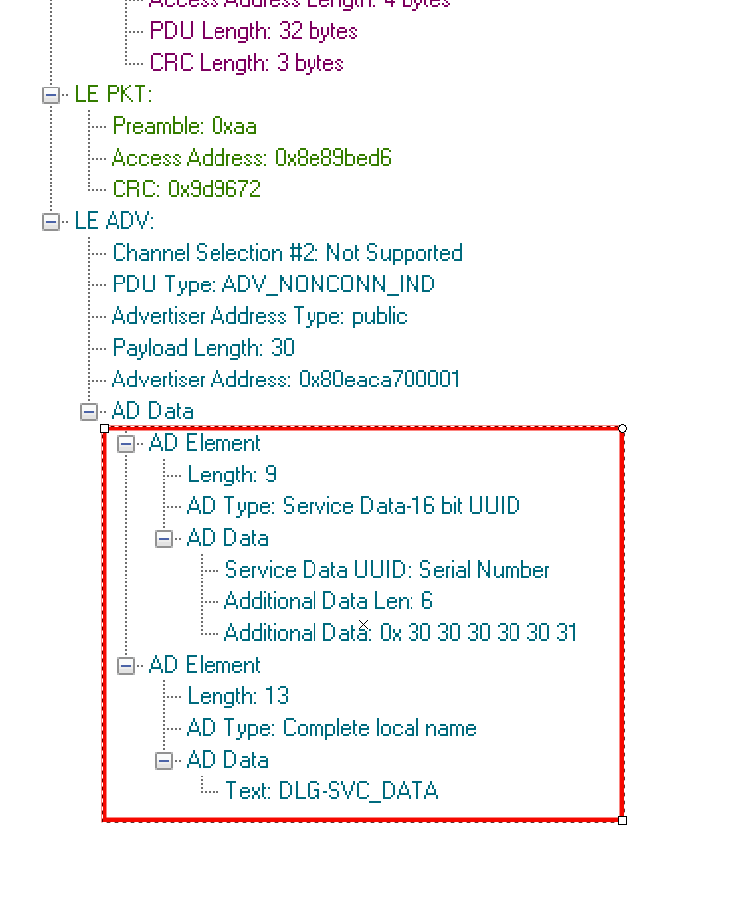

# DA14531-DA14585/586 Service Data Beacon

---

## Example description

The main purpose of this software example is to demonstrate creating a **Non-Connectable Advertising** application example that includes service data.   Specifically, this example illustrates the idea of 
including Service Data from a 16-bit UUID as defined by the Bluetooth SIG.  [Bluetooth SIG GAP Flags](https://www.bluetooth.com/specifications/assigned-numbers/generic-access-profile/).
This example uses the Device Information Service, Serial Number characteristic.

## Non-Connectable Advertising

For getting more information about the Non-Connectable Advertising, please refer to [Advertising Tutorial](https://www.dialog-semiconductor.com/sites/default/files/advertising_concept.pdf) from our [support website](https://www.dialog-semiconductor.com/bluetooth-low-energy).

## HW and SW configuration

- **Hardware configuration**
  - This example runs on the DA14531, DA14585/586 Bluetooth Smart SoC devices.
  - The DA1458x / DA145xx Pro Development kit is needed for this example with default jumper configuration..
  - Connect the USB Development kit to the host computer.
- **Software configuration**
  - SDK6.0.12 or later
  - **SEGGER’s J-Link** tools should be downloaded and installed.
  - A smartphone with a BLE scanning app (for example **BLE scanner** on Android or **Lightblue** on IOS).
  - A BLE Sniffing tool is also useful; though not mandatory .

## How to run the example

### Initial Setup

- For the initial setup, please refer to [this section](https://www.dialog-semiconductor.com/sites/default/files/sw-example-da145x-example-setup.pdf).

- For the DA14585/586 getting started guide you can refer to this [link](http://lpccs-docs.dialog-semiconductor.com/da14585_getting_started/index.html).
- For the DA14531 Getting started guide you can refer to this [link](https://www.dialog-semiconductor.com/da14531-getting-started).

### Compile & Run

- Navigate to ``project_environment`` folder and open the **Keil** project, svc_data_beacon
- Select the target device you are building for, like so,

- Compile (F7) and launch (ctrl + F5) the example.
- You can also download the firmware into SPI Flash. To download the firmware into SPI Flash, the  SPI Flash programmer from SmartSnippets Toolbox should be used as described 
  [here](http://lpccs-docs.dialog-semiconductor.com/UM-B-083/index.html), or the stand-alone flash programmer. 
- The serial number characteristic is a string that is set in user_profiles_config.h.  Be sure to change the length accordingly, if you wish to modify this.  
- This example includes two advertising structures, 1) GAP_LOCAL_NAME 2) Device Serial Number.

To verify please take a look at the BLE sniffer log data, like so,

- The data can be seen in any basic sniffer. Notice the two advertising element structures are readily recognized by the sniffer since they comply to the BLE standard.

- Using an app such as BLE scanner, the raw bytes can be readily seen as well.  Look for DLG-SVC_DATA and select raw data, like so,

	

## How it works
- This example illustrates the basics behind using standard Bluetooth SIG practices for placing advertising ``elements`` into advertising payload.
- The standard practice for adding a single advertising element consists of the following:  
  {1byte - length_byte} , {1-byte gap flag}, {payload}.
- The length byte includes the gap flag and the total lenght of the payload.  The helper function in this example requires the user to specify the .len as the length of the payload.  In the serialization, the value of 1 is added to the length to adhere to standard BLE practices. 
- In this specific case, the GAP flags shows a reference to the Core Supplement, Section A part 1.11.  [link](https://www.bluetooth.org/docman/handlers/DownloadDoc.ashx?doc_id=480305).
- We are using 16-bit service Data, since we are exposing the serial number from the Device Information Service.  
- Referencing the core supplement, the payload requires the first two bytes to be the UUID, followed by the service data. 

## Known Limitations

- Refer to the following application note for [DA1458x known hardware limitations](https://www.dialog-semiconductor.com/sites/default/files/da1458x-knownlimitations_2019_01_07.pdf  "known hardware limitations").
- Refer to the following application note for [DA14531 known hardware limitations](https://www.dialog-semiconductor.com/da14531_HW_Limitation  "known hardware limitations"). 
- Dialog Software [Forum link](https://www.dialog-semiconductor.com/forum).

## License

**************************************************************************************

 Copyright (c) 2020 Dialog Semiconductor. All rights reserved.

 This software ("Software") is owned by Dialog Semiconductor. By using this Software
 you agree that Dialog Semiconductor retains all intellectual property and proprietary
 rights in and to this Software and any use, reproduction, disclosure or distribution
 of the Software without express written permission or a license agreement from Dialog
 Semiconductor is strictly prohibited. This Software is solely for use on or in
 conjunction with Dialog Semiconductor products.

 EXCEPT AS OTHERWISE PROVIDED IN A LICENSE AGREEMENT BETWEEN THE PARTIES OR AS
 REQUIRED BY LAW, THE SOFTWARE IS PROVIDED "AS IS", WITHOUT WARRANTY OF ANY KIND,
 EXPRESS OR IMPLIED, INCLUDING BUT NOT LIMITED TO THE WARRANTIES OF MERCHANTABILITY,
 FITNESS FOR A PARTICULAR PURPOSE AND NON-INFRINGEMENT. EXCEPT AS OTHERWISE PROVIDED
 IN A LICENSE AGREEMENT BETWEEN THE PARTIES OR BY LAW, IN NO EVENT SHALL DIALOG
 SEMICONDUCTOR BE LIABLE FOR ANY DIRECT, SPECIAL, INDIRECT, INCIDENTAL, OR
 CONSEQUENTIAL DAMAGES, OR ANY DAMAGES WHATSOEVER RESULTING FROM LOSS OF USE, DATA OR
 PROFITS, WHETHER IN AN ACTION OF CONTRACT, NEGLIGENCE OR OTHER TORTIOUS ACTION,
 ARISING OUT OF OR IN CONNECTION WITH THE USE OR PERFORMANCE OF THE SOFTWARE.

**************************************************************************************