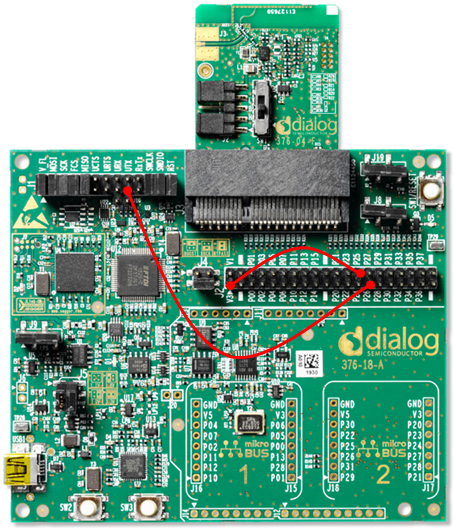
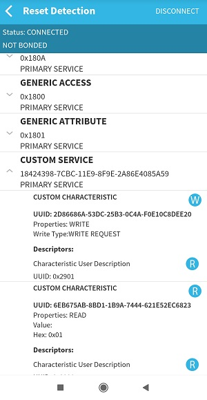
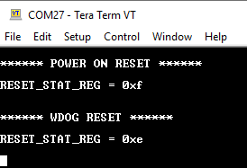

------

# Different ways of handling RESET mechanism in DA14531

------

## Example Description
This SW example aims to demonstrate how to handle different ways of reset mechanism in DA14531 SoC.

## Key Features
- Store data in the uninitialized section of the Retention-RAM
- Detect source of :
    - Hardware reset
    - Software reset
    - Reset by WDOG expiration
    - Power-on-Reset
- Using UART2 for debugging purposes
- 128-bit UUID custom profile

## HW and SW configuration

* **Hardware configuration**
	- This example runs on DA14531 Bluetooth Smart SoC device.
  - Any of the following DA14531 Development Kits can be used : 
    - DA14531 Daughter board + DA145xxDEVKT-P PRO Motherboard
    - DA14531 SmartBond TINY™ Module + DA145xxDEVKT-P PRO Motherboard

  - For running the example on a **DA14531 Daughter board + DA145xxDEVKT-P PRO Motherboard** the following configuration is required.         
      - Connect the DA145xx Pro Development Kit to the host computer.
      - UART TX on P0_6 for DA14531 (Place wire between J1:17 and J2:27) for printing functionality.
	
	

* **Software configuration**

	This example requires:
    * SmartSnippets Toolbox 5.0.14.
    * SDK6.0.14.1114
	- **SEGGER’s J-Link** tools should be downloaded and installed.
	- **A simple serial terminal** should be installed on the PC (e.g. Putty or Teraterm)

## Custom profile
An 128-bit UUID custom profile is included with 1 custom service. 
The BLE database contains 2 characteristics as shown in the table below

<table>
  <caption> <b> <i> Custom Service 1 Characteristic Values and Properties</i></b></caption>
<thead>
  <tr class="header">
  <th style="text-align: left;">Name</th>
  <th style="text-align: left;">Properties</th>
  <th style="text-align: left;">Length(B)</th>
  <th style="text-align: left;">Description</th>
  </tr>
</thead>
<tbody>
  <tr class="odd">
  <td style="text-align: left;">Control Point</td>
  <td style="text-align: left;">Write</td>
  <td style="text-align: left;">2</td>
  <td style="text-align: left;">Accept commands from peer</td>
  </tr>
  <tr class="even">
  <td style="text-align: left;">Reset Detection</td>
  <td style="text-align: left;">Read</td>
  <td style="text-align: left;">20</td>
  <td style="text-align: left;">Update the source of the reset in the peer device</td>
  </tr>
</tbody>
</table>

> __Note:__ 
For more information on adding characteristics in a custom service database and creating Custom Profiles, see [this tutorial](http://lpccs-docs.dialog-semiconductor.com/tutorial-custom-profile-DA145xx/introduction.html).

User can explicitly  cause a RESET by writing the appropriate value in the "Control Point" characteristic, as shown in the table below:

<table>
  <caption> <b> <i> Values of Control Point characteristic</i></b></caption>
<thead>
  <tr class="header">
  <th style="text-align: left;">Value</th>
  <th style="text-align: left;">Description</th>
  </tr>
</thead>
<tbody>
  <tr class="odd">
  <td style="text-align: left;"> 0x01</td>
  <td style="text-align: left;"> Triggering the WDOG timer to generates a WDOG (SYS) reset at value 0 and can not be frozen by Software.</td>
  </tr>
  <tr class="even">
  <td style="text-align: left;"> 0x02</td>
  <td style="text-align: left;">Generating a Software Reset be setting the SYS_CTRL_REG[SW_RESET] bitfield to  1.</td>
  </tr>
  <tr class="even">
  <td style="text-align: left;"> 0x04</td>
  <td style="text-align: left;">Enabling the P0_5 as Power-On Reset (POR) source. A high polarity signal will cause a POR on P0_5.</td>
  </tr>
</tbody>
</table>

> __Note:__ 
In case of the **Hardware Reset**, the RESET button in the Evaluation Board should be used. 

> __Note:__ 
The the POR is enabled, a high polarity signal will cause a POR on P0_5.

Table below demonstrates the different values of the "Reset Detection" characteristic:

<table>
  <caption> <b> <i>Values of Reset Detection characteristic</i></b></caption>
<thead>
  <tr class="header">
  <th style="text-align: left;">Description</th>
  <th style="text-align: center;">Value</th>
  </tr>
</thead>
<tbody>
  <tr class="odd">
  <td style="text-align: left;">No RESET</td>
  <td style="text-align: center;"> 0x00 </td>
  <tr class="odd">
  <td style="text-align: left;">WDOG</td>
  <td style="text-align: center;"> 0x01 </td>
  </tr>
  <tr class="odd">
  <td style="text-align: left;">Software Reset</td>
  <td style="text-align: center;"> 0x02 </td>
  </tr>
  <tr class="odd">
  <td style="text-align: left;">Hardware Reset</td>
  <td style="text-align: center;"> 0x03 </td>
  </tr>
  <tr class="odd">
  <td style="text-align: left;">Power-on-Reset</td>
  <td style="text-align: center;"> 0x04 </td>
  </tr>
</tbody>
</table>

## Reset Mechanism in DA14531

See **Section 5** in [DA14531 datasheet](https://www.dialog-semiconductor.com/da14531_datasheet) for more detailed information on RESET functionality .

There are three (3) main reset signals in the DA14531:
- ***Power-On Reset (POR) :*** it is optional triggered by a GPIO set as the POR source with a
selectable polarity and/or the RST pad (P0_0) after a programmable time delay
- ***HW reset :*** it is optional triggered by the RST pad (P0_0) when it becomes active for a short
period of time (less than the programmable delay for POR)
- ***SW reset :*** it is triggered by writing the SYS_CTRL_REG[SW_RESET] bit

The SDK6 provides a function-wrapper, namely ``reset_indication()``  to notify the application that system has been reset. This function reads the **RESET_STAT_REG** register. 

Depending on the source of the reset, the bits in the **RESET_STAT_REG**. The table below is showing the different values (in hex) of **RESET_STAT_REG** :

<table>
  <caption> <b> <i>Values of RESET_STAT_REG</i></b></caption>
<thead>
  <tr class="header">
  <th style="text-align: left;">Description</th>
  <th style="text-align: center;">WDOGRESET_STAT</th>
  <th style="text-align: center;">SWRESET_STAT</th>
  <th style="text-align: center;">HWRESET_STAT</th>
  <th style="text-align: center;">PORESET_STAT</th>
  <th style="text-align: center;">Value (hex)</th>
  <th style="text-align: left;">Macro Definition</th>
  </tr>
</thead>
<tbody>
  <tr class="odd">
  <td style="text-align: left;">WDOG</td>
  <td style="text-align: center;">1</td>
  <td style="text-align: center;">1</td>
  <td style="text-align: center;">1</td>
  <td style="text-align: center;">0</td>
  <td style="text-align: center;">0x0E</td>
  <td style="text-align: left;">WDOGRESET_VAL</td>
  </tr>
  <tr class="odd">
  <td style="text-align: left;">Software Reset</td>
  <td style="text-align: center;">0</td>
  <td style="text-align: center;">1</td>
  <td style="text-align: center;">0</td>
  <td style="text-align: center;">0</td>
  <td style="text-align: center;">0x04</td>
  <td style="text-align: left;">SWRESET_VAL</td>
  </tr>
  <tr class="odd">
  <td style="text-align: left;">Hardware Reset</td>
  <td style="text-align: center;">0</td>
  <td style="text-align: center;">1</td>
  <td style="text-align: center;">1</td>
  <td style="text-align: center;">0</td>
  <td style="text-align: center;">0x06</td>
  <td style="text-align: left;">HWRESET_VAL/td>
  </tr>
  <tr class="odd">
  <td style="text-align: left;">Power-on-Reset</td>
  <td style="text-align: center;">1</td>
  <td style="text-align: center;">1</td>
  <td style="text-align: center;">1</td>
  <td style="text-align: center;">1</td>
  <td style="text-align: center;">0x0F</td>
  <td style="text-align: left;">PORESET_VAL</td>
  </tr>
</tbody>
</table>

For more information on **RESET_STAT_REG**, see **Table 270** in [DA14531 datasheet](https://www.dialog-semiconductor.com/da14531_datasheet).

## How to run

### Initial Setup

For the initial setup of the project that involves linking the SDK to this SW example, please follow the Readme [here](__Github sdk6 readme link__).

- For the DA14531 Getting started guide you can refer to this [link](https://www.dialog-semiconductor.com/da14531-getting-started).

### Compile & Run

1. Open the project via Keil µVision 5

2. Build the project and load it to target. The project can be run either from ``System-RAM`` or ``SPI Flash``. 
    > __Note:__ 
    In case of SPI Flash, the [Flash Programmer](http://lpccs-docs.dialog-semiconductor.com/UM-B-083/tools/SPIFlashProgrammer.html) from SmartSnippets Toolbox should be used. Refer to the [user manual](http://lpccs-docs.dialog-semiconductor.com/UM-B-083/index.html) to get familiar with the SmartSnippets Toolbox.

3. Set up a serial terminal session by selecting the proper virtual COM port and set the port configuration as shown below:
      - Baudrate: 115200
      - Data: 8 bits
      - Stop: 1 bit
      - Parity: None
      - Flow  control: none

    > __Note:__ 
    Refer to **Section 10** in [Get Started tutorial](http://lpccs-docs.dialog-semiconductor.com/Tutorial_SDK6/serial_port.html) for more information on enabling the UART for debugging purposes.

4. In the initial boot, the following message should be displayed in the Serial Terminal:

    

5. Open a generic BLE mobile application and the ``Reset Detection`` device name should be detected, as shown below.

    

6. Connect to the ``Reset Detection``

7. Once the device is connected to the cell phone, a custom service with two(2) should be detected.

    

8. Write **0x01** for triggering a WDOG. 

9. After the device reboots, in the serial terminal the following message should be displayed indicating that the source of the RESET was the WDOG expiration.

    

10. If it is re-connected to the mobile application, the value  of the **Reset detection** characteristic should be **0x01**. 

## Known Limitations

- There are no known limitations for this example. But you can check and refer to the following application note for [known hardware limitations for DA14531 devices](https://www.dialog-semiconductor.com/da14531_HW_Limitation).
- For general support questions, please contact the [Dialog Forum](https://www.dialog-semiconductor.com/forum).
- You can also refer to the [DA14531 Getting Started guide](https://www.dialog-semiconductor.com/da14531-getting-started).

