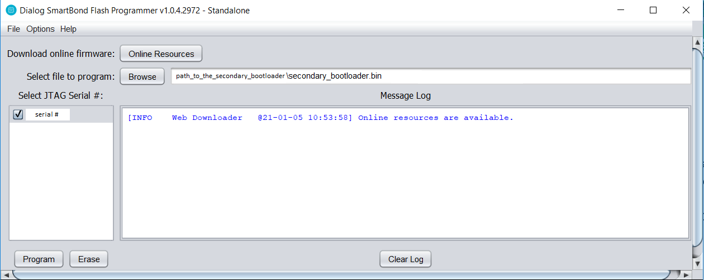
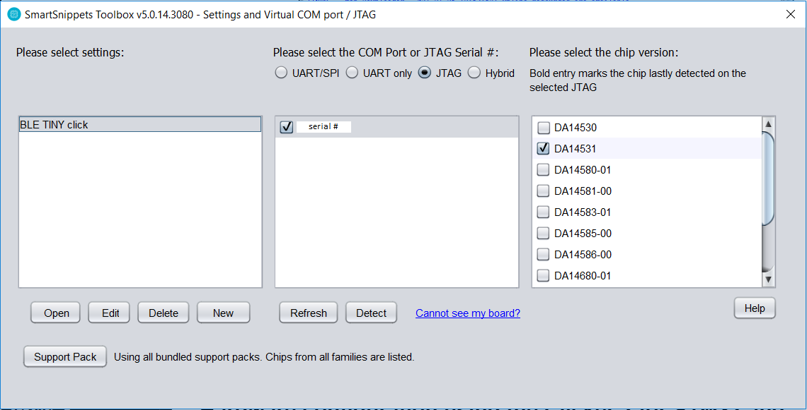
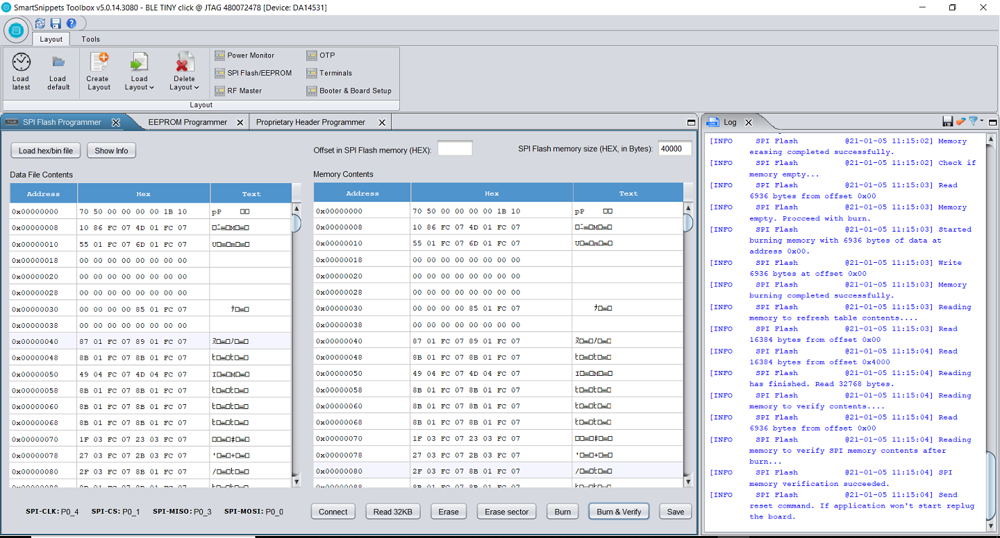
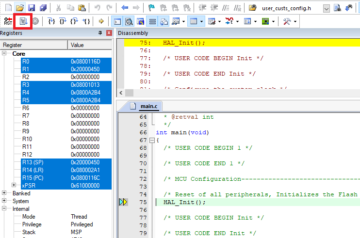
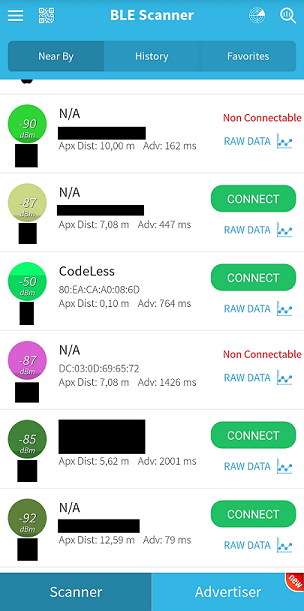
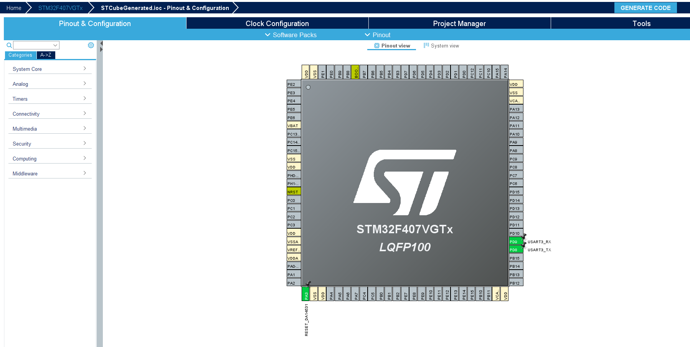

# Booting the DA14531 with Codeless through a STM32

---

## Example description

The DA14531 has an integrated ARM Cortex M0+ and can be used for programming and controlling the SoC. Due to the small form factor the ARM Cortex has its limitations. A solution for the limitations of the integrated microprocessor can be to use an external microprocessor. To control the DA14531 with this microprocessor some code is still needed on the DA14531. Fortunately, the DA14531 can execute code from RAM that can be loaded in during its boot sequence. This way a microcontroller can load a program onto the DA14531.

The goal of this example is to show how to load a program into the RAM of the DA14531 via a STM32 microcontroller. This example shows the flow of the code and how it can be configured. The program that is booted on the DA14531 in this example is called Codeless. The interface that is used for booting Codeless is UART. Codeless is a solution by Dialog to interface with the DA14531 with AT commands. More info on Codeless and its use can be found on [here](https://www.dialog-semiconductor.com/products/smartbond-codeless-commands). In this example it will only be used to verify that the program has loaded correctly.

## HW and SW configuration

### Required hardware

- A pc workstation
- Clicker 2 for STM32 development board by MikroE
- A DA14531 Clickboard (BLE TINY click) programmed with the secondary bootloader (*secondary_bootloader.bin* is included with the project.)
- SEGGER J-Link
- (optional) DA14531 Development Kit Pro Motherboard

### Programming the BLE TINY click with the secondary bootloader

The Dialog Flash Programmer can be used to program the flash of the BLE TINY click, the flash programmer can be found [here](https://www.dialog-semiconductor.com/sites/default/files/smartbondflashprogrammer_v1.0.4.2972_windows.zip). Another option for programming the flash of the BLE TINY click using the SmartSnippets Toolbox which can be found [here](https://www.dialog-semiconductor.com/sites/default/files/smartsnippets_toolbox_v5.0.14.3080_windows.msi.zip).

The first step to programming the flash is connecting the BLE TINY click to the programming interface. For this either a DA14531 Development Kit Pro Motherboard or a SEGGER J-LINK can be used. In the images below the connections for both options can be viewed.

**DA14531 Development Kit Pro Motherboard**

**SEGGER J-LNK**

The next step is programming the BLE TINY click. The first one to be explained is the _Dialog Flash Programmer_ and after that the _SmartSnippets Toolbox_

**Dialog Flash Programmer**

Start the Dialog Flash Programmer. In the screen two options can be observed, the device to program with and the file to program and the file to program to the device. First click _Browse_ and select the path to the _secondary\_bootloader.bin_. Next select the device used for programming (the device is displayed by its serial number, which can be found on the SEGGER or the motherboard.)

After these steps the programmer should look like this:

Lastly click _Program_ and the BLE TINY click should be programmed with the secondary bootloader.

**SmartSnippets Toolbox**

Open the SmartSnippets Toolbox. The first step is to setup a device, by clicking on _New_. Give the device settings a name, for example: _BLE TINY click_ and optionally a description. Click on save and the settings should appear in the left panel, click on it. In the selection **Please select the COM Port or JTAG Serial #:** select _JTAG_. Next select the serial number of the SEGGER or the Motherboard. In the right panel select the _DA14531_ and the settings should be correct. It should look like the following:

Next click on _Open_ and the Toolbox should open on the programming screen. First select the _secondary\_bootloader.bin_ by clicking on _Load hex/bin file_ and following the options in the scree that opens. Next click on _Connect_ and after the connection has been made click _Burn & Verify_ and the secondary bootloader should be programmd. The end result should look like this:

### Hardware configuration using the Clicker 2 for STM32 and the MikroE BLE TINY click

- Connect the J-Link Segger to the Clicker 2 for STM32 J-TAG header using SWD configuration
- Put the DA14531 Clickboard in the second MikroBUS slot of the Clicker 2 for STM32 (slot 1 can be used, but changes have to be made to the code configuration. This is explained further on in this document)

### Software configuration

**This example requires:**

- Keil 5
- **SEGGER’s J-Link** tools should be downloaded and installed.
- BLE scanner for your smartphone (in this example BLE Scanner for Android is used)

**Flow of the code**

**Running the code**

Open the Keil project file located in **project_environment/MDK-ARM** folder and once it has opened click the **Options for target...** Button. In this screen go to Debug and set the debugger to **J-LINK / J-TRACE Cortex**
After setting the debugger click on the **Settings** Button. Within this screen select the J-link module that is connected and set the **Port:** to **SW**. Save these settings.

After all the settings have been set the project can be built. Press the **Build** button or the **F7** key to start building the project.
When the build is done press the **Start/Stop Debug Session** button or the key combination **Ctrl + F5** to load to program into the STM32.

In the debug screen press the **Run** button or the **F5** key to start the program and the boot process should start.

## Expected Result

After about 5 seconds when the run button is pressed the DA14531 should start advertising itself as **Codeless** (this is the standard advertising name for Codeless). Down below a screenshot can be seen from BLE scanner for Android after the boot was successful.

## Code settings

The booting process has two options 1 wire UART and 2 wire UART, in this example the booting process is done through 2 wire UART. This can be configured by either passing _TWO\_WIRE_ or _ONE\_WIRE_ to the booting function.

Another important parameter of the boot function is the CRC parameter. The CRC is to check whether the code received by the DA14531 is correct. It is calculated with the _crc_calculate_ function and passed to the boot function.

Within the boot_config.h file two settings can be found. The BOOT_ATTEMPTS and TIMEOUT_TIME define these settings. The BOOT_ATTEMPTS dictates how many attempts should be taken to start the booting process. The TIMEOUT_TIME defines the amount of time the UART should wait before a byte as received, this is a blocking process.

## Side Notes

The project is setup using STM32CubeMX and the .ioc is provided with the project so changes can be made should they be necessary for the user. The settings used in STM32CubeMX are as follows:

As an example, the UART pins can be changed to pins **PD5** and **PD6** to use the first MikroBUS slot. Keep in mind that the UART handle changes in the code and that the correct one should be passed to the boot function.

## Known Limitations

- Refer to the following application note for DA14531 known [hardware limitations](https://www.dialog-semiconductor.com/da14531_HW_Limitation)
- Also refer to Dialog Software [Forum Link](https://support.dialog-semiconductor.com/forum)

## License

**************************************************************************************

 Copyright (c) 2020 Dialog Semiconductor. All rights reserved.

 This software ("Software") is owned by Dialog Semiconductor. By using this Software
 you agree that Dialog Semiconductor retains all intellectual property and proprietary
 rights in and to this Software and any use, reproduction, disclosure or distribution
 of the Software without express written permission or a license agreement from Dialog
 Semiconductor is strictly prohibited. This Software is solely for use on or in
 conjunction with Dialog Semiconductor products.

 EXCEPT AS OTHERWISE PROVIDED IN A LICENSE AGREEMENT BETWEEN THE PARTIES OR AS
 REQUIRED BY LAW, THE SOFTWARE IS PROVIDED "AS IS", WITHOUT WARRANTY OF ANY KIND,
 EXPRESS OR IMPLIED, INCLUDING BUT NOT LIMITED TO THE WARRANTIES OF MERCHANTABILITY,
 FITNESS FOR A PARTICULAR PURPOSE AND NON-INFRINGEMENT. EXCEPT AS OTHERWISE PROVIDED
 IN A LICENSE AGREEMENT BETWEEN THE PARTIES OR BY LAW, IN NO EVENT SHALL DIALOG
 SEMICONDUCTOR BE LIABLE FOR ANY DIRECT, SPECIAL, INDIRECT, INCIDENTAL, OR
 CONSEQUENTIAL DAMAGES, OR ANY DAMAGES WHATSOEVER RESULTING FROM LOSS OF USE, DATA OR
 PROFITS, WHETHER IN AN ACTION OF CONTRACT, NEGLIGENCE OR OTHER TORTIOUS ACTION,
 ARISING OUT OF OR IN CONNECTION WITH THE USE OR PERFORMANCE OF THE SOFTWARE.

**************************************************************************************
