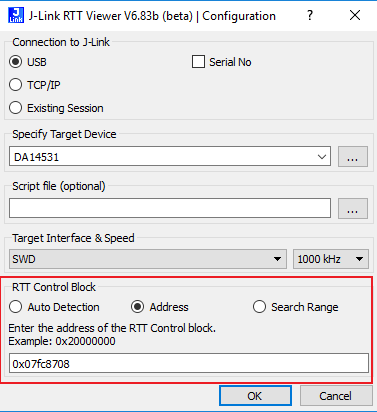

# DA14585/DA14586/DA14531 Segger RTT example

---

## Example description

This example illustrates to the user, how to use SEGGER RTT in conjunction with the DA145xx family. 
	

## HW and SW configuration
This example runs on the BLE Smart SoC (System on Chip) devices:
- DA14585/DA14586 or DA14531 daughter board + DA145xxDEVKT-P PRO-Motherboard.
- DA14585/DA14586 Basic development Kit.
- DA14531 USB Kit

The user manuals for the development kits can be found:
- [DA14531 Development Kit Product page](https://www.dialog-semiconductor.com/products/da14531-development-kit-pro) for the DA145xxDEVKT-P PRO-Motherboard.
- [DA14585 Development Kit Basic](https://www.dialog-semiconductor.com/products/da14585-development-kit-basic) for the Basic Development Kit.
- [DA14531 USB Development Kit Product page](https://www.dialog-semiconductor.com/products/da14531-development-kit-usb) for the DA14531 USB Development Kit.

* **Hardware configuration DA14585 using the DA145xxDEVKT-P PRO-Motherboard**

	- No special Hardware configuration is needed other than a physical link to the chip via JTAG.
	
* **Software configuration**

	- This example requires:
    * SDK6.0.12 or Newer (Older versions of SDK6 require minimal changes)
	- **SEGGER’s J-Link** tools should be downloaded and installed.

## How to run the example

### Setup

For the initial setup of the project that involves linking the SDK to this SW example, please follow the Readme [here](__Github sdk6 readme link__).

1. Start Keil using the `user_segger_rtt_periph` Keil project file.

2. Expand the dialog shown in the red box in the image below.
	
	

3. Select your target device: DA14531, DA14585, DA14586

4. Compile (F7) and launch (ctrl + F5) the example.\

5. You will need the address of the SEGGER RTT Control Block for the next step.  This project automatically locates the CB in the beginning of retention RAM so the user doesn't need to locate the address after each build.  If using SDK 6.0.14, the default address is commented in segger_rtt/SEGGER_SWD_printf.h copy this address and proceed to step 8.  If not using SDK 6.0.14, then proceed to step 6.

6. Right click on the project in the Project window and select 'Open Map File'
	
	

7. In the map file, use CTRL+F and search for _SEGGER_RTT and copy this address. 

	

8. Open Segger J-Link RTT Viewer and a prompt screen will open. Be sure the following settings match - USB, Target (DA14531 - M0+, DA14585/86 - M0), and SWD.  For the RTT Control Block, use the address found in steps 5-7. Once this is completed, Press OK.

	
	

### Running the Example - Scan and Connect

1. Start a debugging session.
	
	

2. Make the RTT Viewer terminal window visible and you should see Data printing out every second.  Additionally, you will see debug information displayed on startup, connect, and disconnect.
	
	

## Including RTT in another Project

1. Copy the segger_rtt folder and place it in the same directory as your src folder. 

2. Right Click on the project in the Project Window and Select Manage Project Items.

3. Under Groups, select New (Insert) and name it segger_rtt.  
	
	
	
4. In the project Window, right click on segger_rtt window and select Add Existing Files to Group 'segger_rtt'.

5.  Navigate to the RTT folder and add all files from this folder location. 

6.  Add this folder to the include directories.
	- Right Click on the project and select Options for Target 'DA145xx'.  
	- Go to C/C++
	- Expand the Include Paths
	- Selecet New (Insert)
	- For this example, the include path is at .\..\segger_rtt\RTT
	
	
	
7.  In user_config Project folder, navigate to da1458x_config_advanced.h.  The CFG_RET_DATA_SIZE will need updated, add the following lines of code and replace the current defintition of CFG_RET_DATA_SIZE. Be sure to include this definition in both DA14531 and DA14585/6 settings.

	/****************************************************************************************************************/
	/* Enables SEGGER RTT Debugging                                                            */
	/* NOTE: Enabling increases the size of retetention DATA                                          */
	/****************************************************************************************************************/
	#define CFG_SWD_PRINTF
	/****************************************************************************************************************/
	/* Maximum retention memory in bytes. The base address of the retention data is calculated from the selected    */
	/* size.                                                                                                        */
	/****************************************************************************************************************/

	#ifdef CFG_SWD_PRINTF
		#define CFG_RET_DATA_SIZE    (2048 + 0x4b8)
	#else
		#define CFG_RET_DATA_SIZE    (2048)
	#endif 

## Known Limitations

- There are no known limitations for this example. But you can check and refer to the following 
  application note for known hardware limitations.
For DA14531 devices:
  [DA14531 hardware limitations](https://www.dialog-semiconductor.com/sites/default/files/da14531_errata_1v0.pdf)
For DA14585 devices:
  [DA14585 hardware limitations](https://www.dialog-semiconductor.com/sites/default/files/da1458x-knownlimitations_2019_01_07.pdf)
- Dialog Software [Forum Link](https://support.dialog-semiconductor.com/forums/dialog-smartbond-bluetooth-low-energy-%E2%80%93-software "Forum Link").
- You can also refer to the troubleshooting section in the [Getting Started with the DA14531 PRO Development Kit](http://lpccs-docs.dialog-semiconductor.com/UM-B-117-DA14531-Getting-Started-With-The-Pro-Development-Kit/index.html).

