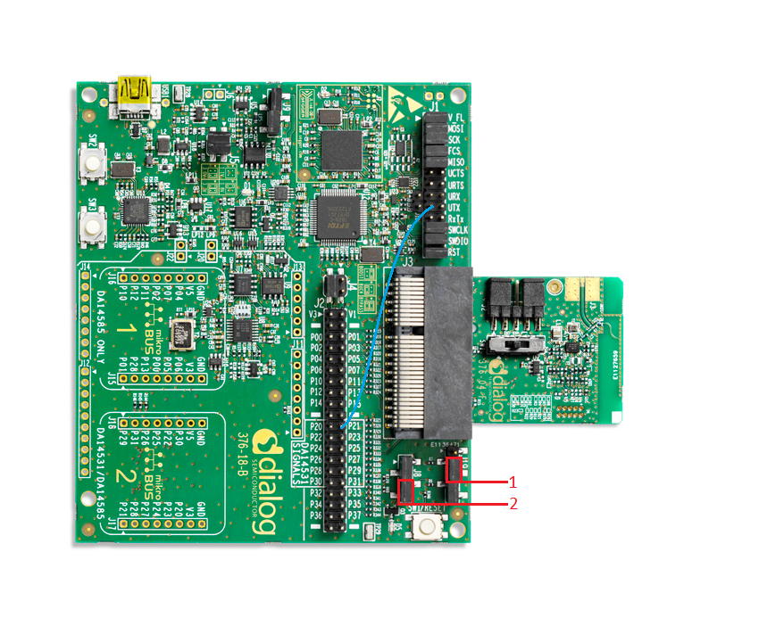
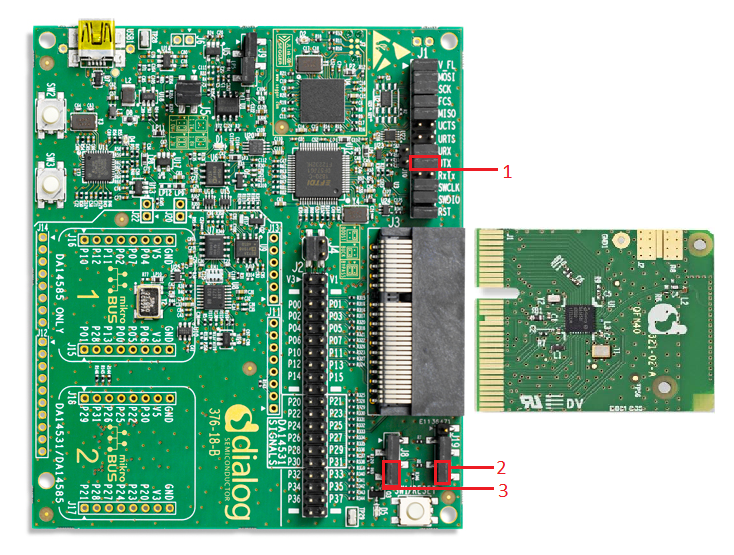

# DA14585/DA14586/DA14531 Peripheral - GPIO button interrupt with edge detection

---


## Example description

This example shows:
How to configure a button for
- Short press (< 3 seconds).
- Long press (>= 3 seconds).

The expected result of the example can be verified by:
- Connecting a serial terminal on the work station to the MB (Mother Board) using UART.
- Means of a blinking LED.

## HW and SW configuration
This example runs on the BLE Smart SoC (System on Chip) devices:
- DA14585/DA14586 or DA14531 daughter board + DA145xxDEVKT-P PRO-Motherboard.
- DA14585/DA14586 daughter board + Basic dev Kit mother board.

The user manuals for the development kits can be found:
- [here](https://www.dialog-semiconductor.com/products/da14531-development-kit-pro) for the DA145xxDEVKT-P PRO-Motherboard.
- [here](https://www.dialog-semiconductor.com/sites/default/files/um-b-048_da14585da14586_getting_started_guide_v2.0_0.pdf) for the Basic Development Kit.

* __Hardware configuration DA14531 using DA145xxDEVKT-P PRO-Motherboard__

	- UART TX: connect P21 on J2 to UTX pin 17 on J1 as shown in the image below (the blue line).
	- LED jumper on J8 is configured to P0_9 (red box 2).
	- Button jumper on J19 is configured from SW2 pin to P3_1 (red box 1)
		- To clarify the J19 configuration from up (see arrow on MB): pin, jumper, jumper, pin, pin. 
	- Connect the DA145xxDEVKT-P PRO-Motherboard to the working station through USB1 connector.

	The image below shows the Motherboard with jumper (wire) configuration for the DA14531.

	
		
* __Hardware configuration DA14585 using the DA145xxDEVKT-P PRO-Motherboard__

	- UART TX jumper on P0_4, located on J1 (red box 1).
	- LED jumper is configured to P1_0, located on J8 (red box 3).
	- Button jumper is configured from SW3 pin to P1_1, located on J19 (red box 2).
	- Connect the DA145xxDEVKT-P PRO-Motherboard to the working station through USB1 connector.

	The image below shows the Motherboard with jumper configuration for the DA14585

	

* __Hardware configuration DA14585 using the basic dev kit__

	- UART TX/RX jumper on P0_4/P0_5, located on J4.
	- LED jumper is configured to P10, located on J9.
	- An active-low switch should be connected to P1_1, located on J4, as displayed in the following schematic.
	- Connect the basic dev kit to the working station through USB1 connector.

	

* __Software configuration__
This example requires:
	- [SDK6.0.12](https://www.dialog-semiconductor.com/da14531_sdk_latest).
	- Keil5.
	- __SEGGER’s J-Link__ tools should be downloaded and installed.
	- Serial Terminal software. For example Tera Term or PuTTY.

## How to run the example

### Setup

For the initial setup of the project that involves linking the SDK to this SW example, please follow the Readme [here](__Github sdk6 readme link__).

1. Start Keil using the `simple_button.uvprojx` Keil project file.
 
2. Expand the dialog shown in the red box in the image below.


3. Select your device: DA14531, DA14586 or DA14585.
		


4. Open a serial terminal on the work station using for example Tera Term/PuTTY with the following parameters:
```
- baud rate: 115200
- data: 8 bits
- stop: 1 bit
- parity: None
- flow  control: none
```

5. Compile (F7) and launch (ctrl + F5) the example.\
If the warning (shown below) pops up press OK.
 


## Expected Results
The button interrupt with edge detection example is now running. Follow the steps according to your Mother board and daughter board.

### DA14585/DA14586/DA14531 with DA145xxDEVKT-P PRO-Motherboard
1. The LED controlled in this example is `D5` and the color is `orange`.

2. Have the serial UART monitor active: status messages will be displayed here as shown in the following image. See step `4` in ["How to run the example"](#How-to-run-the-example) for setting up the serial monitor.


2. Identify button:
	- DA14531 uses `SW2` as button in this example
	- DA14585/DA14586 uses `SW3` as button in this example

3. Pressing the button for less than 3 seconds (= short press):
	- Toggles the LED status.
	- Sends a message to the serial terminal indicating the LED should be on or off. 

4. Pressing the button for 3 or more seconds (= long press):
	- Start toggling the LED status with a set interval (software configured).
	- Sends messages to the serial terminal indicating the LED should be blinking.

5. Pressing the button again:
	- Stops LED blinking.

### DA14585/DA14586 Basic Dev Kit
1. The LED controlled in this example is `USR` and the color is `green`.

2. Have the serial UART monitor active: status messages will be displayed here as shown in the following image. See step `4` in ["How to run the example"](#How-to-run-the-example) for setting up the serial monitor.


3. Pressing the button for less than 3 seconds (= short press):
	- Toggles the LED status.
	- Sends a message to the serial terminal indicating the LED should be on or off. 

3. Pressing the button for 3 or more seconds (= long press):
	- Start toggling the LED status with a set interval (software configured).
	- Sends messages to the serial terminal indicating the LED should be blinking.
	
4. Pressing the button again:
	- Stops LED blinking.

## Troubleshooting
- Please check that the steps according to your daughter board (DA14531, DA14585 or DA14586) and mother board (basic dev kit or DA145xxDEVKT-P PRO-Motherboard) are followed correctly.

- Try a different USB1 cable.

- Try different jumper wire, if used.

- If none of the steps described above help, please check the user manual according to your daughter board and mother board. User manual can be found ["here"](##HW-and-SW-configuration)

